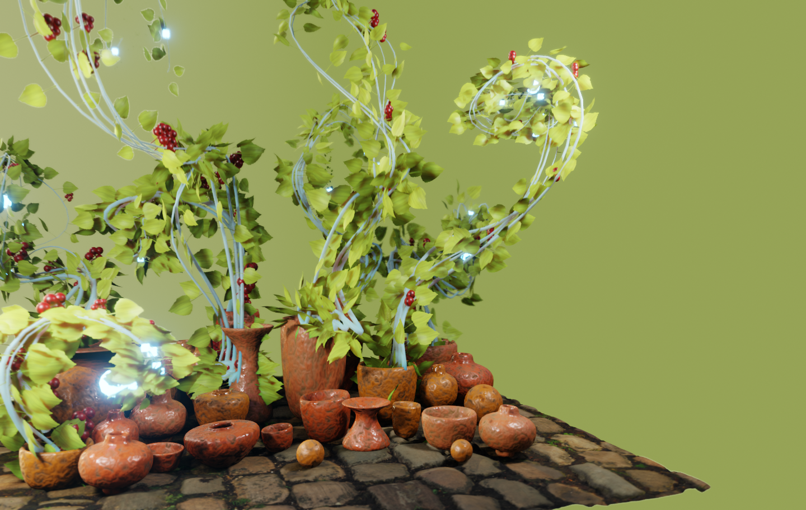
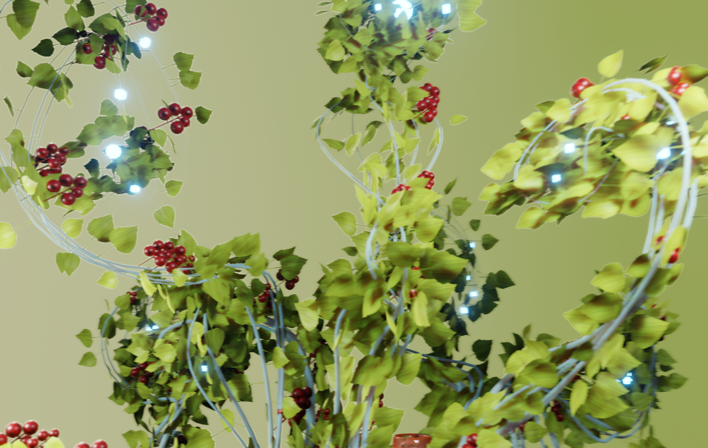
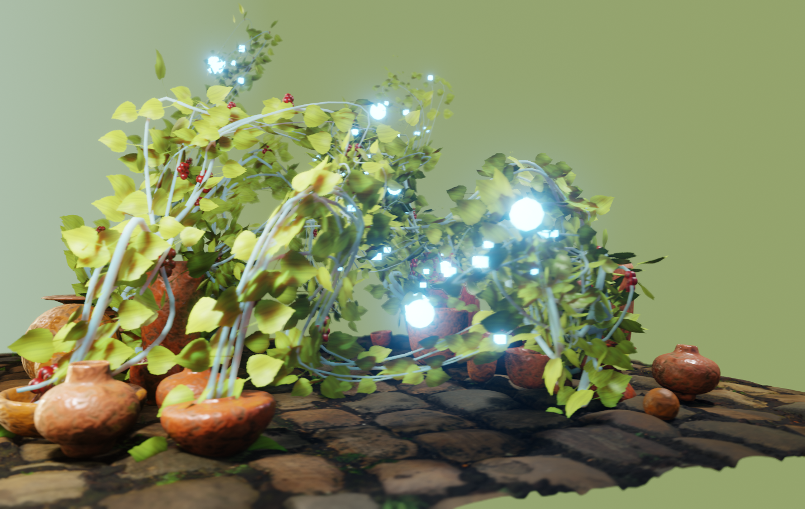
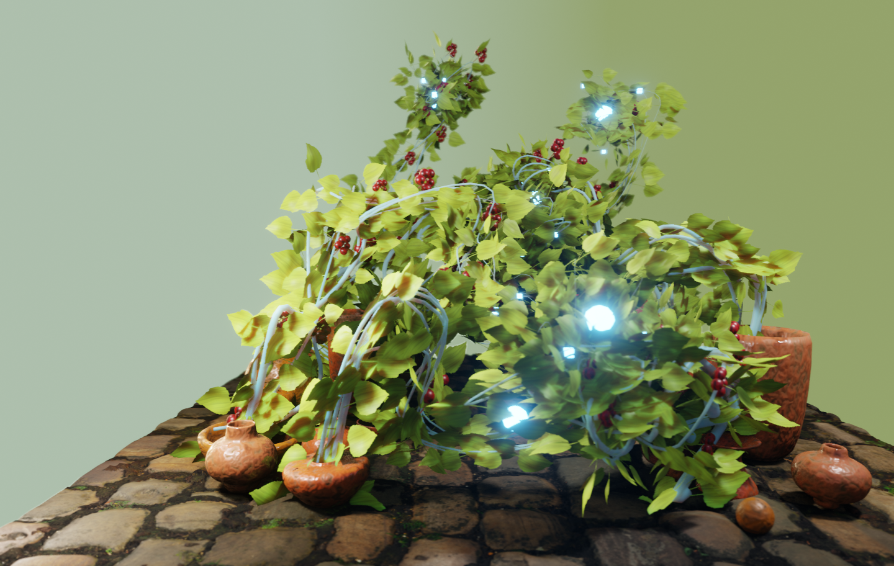
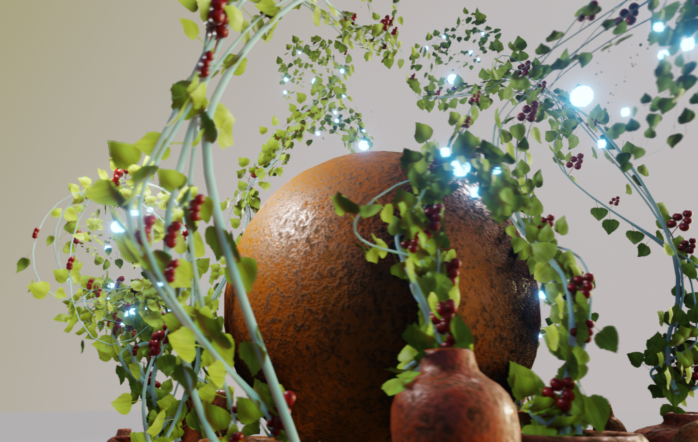
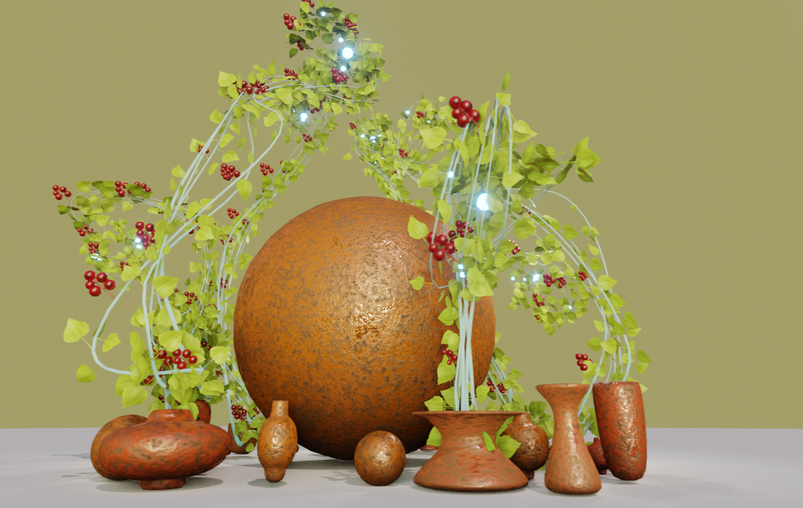

# Spline Morphology

Blender animation.

Mix of manual and procedural approach.

User defines splines (e.g., using draw splines in edit mode) and code creates procedural growth of branches, leafs and fruits.

# Animations:

https://vimeo.com/user115148750

# Results:

